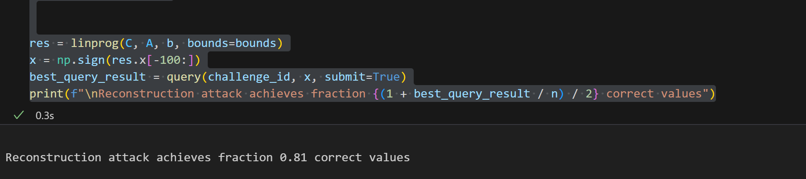

### (a)

Let $x=(-1,-1...,-1)$ and it neighboring dataset $x'=(1,-1,-1...-1)$.  Given $z\sim Lap(\lambda)$, 
$$
M(x)=<x,q>+z\sim Lap(<x,q>,\lambda)
$$

$$
M(x')=<x',q>+z \sim Lap(<x',q>,\lambda)
$$

$$
\begin{aligned}
\frac {Pr(M(x)=x)}{Pr(M(x')=x)} &= \frac{\frac 1 {2\lambda} \exp({-\frac{|x-<x,q>)}{\lambda})}}{\frac 1 {2\lambda} \exp (-\frac {|x-<x',q>|}{\lambda})} \\
&=\exp(\frac {|x-<x',q>|}{b}-\frac{|x-<x,q>)}{\lambda}) \\
&\le \exp(\frac {|<x,q>-<x',q>|}{\lambda}) \;\;\;\; (\text{Triangle inequality},|a|-|b|\le|a-b|) \\
\end{aligned}
$$

Then
$$
<x,q>-<x',q> = \sum_ix_iq-\sum_ix'_iq = q(\sum_i(x_i-x'_i))
$$
Given that there is only one bit different between $x$ and $x'$, so $\sum_i(x_i-x'_i)\le2$

So,
$$
\frac {Pr(M(x)=x)}{Pr(M(x')=x)} \le \exp (\frac 2 \lambda)
$$
According to the definition of differential privacy,

any single query is $\epsilon$-differentially private with $\epsilon = \frac 2 \lambda$.


### (b)

Our object function is to minimize the sum of error $e_i$ :
$$
\text{minimize} \, \sum_i|e_i|
$$
where $i \in N$, is the number of query. And in this situation, $N=200$

And $e_i$ is computed from each query $q_i$:
$$
e_i = \tilde a_i -q_i^Tx
$$
where $\tilde a_i$ is the response of the mechanism for $i$-th query and $x$ is the real dataset.

As for bounds, to relax the restriction, we let
$$
0\le x_i \le1
$$
and in the end, we use `np.sign` to get the prediction.


To deal with absolute value in the object function, we let $e_i =e_i^+-e_i^-$ and $|e_i|=e_i^++e_i^-$, and $e_i^+,e_i^- \ge 0$.

So the total optimization problem is as follow:
$$
\text{minimize} \sum_i e_i^++e_i^- \\
s.t. \;\;\; 0\le x_i \le 1 \\
e_i+q_i^Tx=\tilde a_i \\
e_i^+,e_i^- \ge0
$$
Then we use `scipy.optimize.linprog` to solve this linear programming problem. The core code is as follow:

```python
# Linear programming
import numpy as np
from scipy.optimize import linprog

A, b, C, bounds = np.zeros((2*n, 4*n+n)), np.zeros((200,1)), np.zeros((1, 4*n+n)), np.zeros((4*n+n, 2))

# objective function
C[:4*n] = 1

# equation cons
A[:,:2*n] = np.eye(2*n)
A[:,2*n:4*n] = -np.eye(2*n)
A[:,4*n:] = queries

b = query_results.reshape(b.shape)

# bounds
bounds[:4*n, 1] = None 
bounds[4*n:, 0] = -1 
bounds[4*n:, 1] = 1 


res = linprog(C, A, b, bounds=bounds)
x = np.sign(res.x[-100:])
best_query_result = query(challenge_id, x, submit=True)
print(f"\nReconstruction attack achieves fraction {(1 + best_query_result / n) / 2} correct values")
```


And the final result is 0.81:



Detailed code is published on [my github respository](https://github.com/Fuyao233/ATML_Assignment): A1>>A1.ipynb.

Another algorithm modeling the problem from the perspective of  integer quadratic programming is also implemented.


### (c)

For each bit $x$, given $Pr(M(x)=x) = \frac 3 4$, $Pr(M(x')=x)=\frac 1 4$, $\epsilon^{bit} = ln \frac {\frac 3 4} {\frac 1 4}=ln\,3$.

For the 2-bit strings $\epsilon = 2\epsilon^{bit} = ln\,9$

So $\mathcal{M}$ satisfies ($ln9$)-differential privacy


### (d)

Define $M'$ as following:
$$
M'(x)=\begin{cases}x& p \\ \text{other cases} & \frac 1 3 \cdot(1-p) \end{cases}
$$
Given 
$$
\frac {Pr(M'(x) \in \mathcal{X})} {Pr(M'(x')\in \mathcal{X})} \le \frac{Pr(M'(x)=x)}{Pr(M'(x')=x)}=\frac p {\frac 1 3 \cdot (1-p)}
$$
According to the question, $M$ satisfies (ln9)-differential privacy, so
$$
\frac {3p} {1-p} = \exp (\ln9) = 9
$$
so $p=\frac 3 4$

As for $Pr(M(x)=x)$, $M(x)=x$ means the mechanism outputs two bits truly at the same time. As the probability that the mechanism outputs one bit truly is $\frac 3 4$, $Pr(M(x)=x)=\frac 9 {16}$   

And when $p=\frac 3 4$, $Pr(M'(x)=x)=\frac 3 4$. 

As a result, the inequality $Pr(M'(x)=x) > Pr(M(x)=x) \Leftrightarrow \frac 3 4 > \frac 9 {16}$, which is satisfied either.