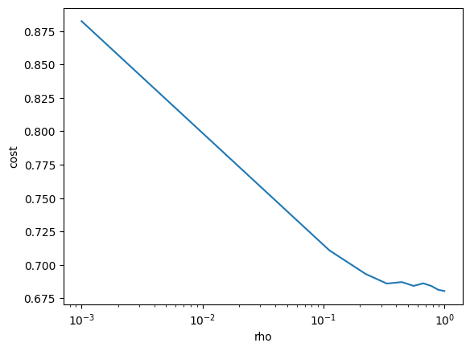

# 1.

## (a)

According to the description, 
$$
M'_{means}=(f_l(x)+z_l,g_x(x)+z'_l), l\in[t]
$$
And 
$$
M_{means}= c^l=(c_1^l,c_2^l,...,c_k^l), l\in [t]
$$


Given 
$$
c_i^l=\frac{1}{\max\{1,n_i^{l-1}\}}(z_{l,i}+\sum_{j\in S_i ^{(l-1)}}x_j)
$$
and
$$
f_l(x)_i=\sum_{j\in S_i ^{(l-1)}}x_j
$$
Then
$$
c^l=w^T(f_l(x)+z_l), \\
w_i=\frac 1 {\max\{1,n_i^{l-1}\}}, i \in [k]
$$
Let $Y$ and $Y'$ be the output spaces of $M_{means}$ and $M_{means}'$. So there is a post processing function $\Gamma:Y' \times Y' \rightarrow Y$ and let it do such mapping:
$$
\begin{aligned} 
\Gamma(M'_{means}) & = \Gamma(f_l(x)+z_l,g_x(x)+z'_l) \\
&= w^T(f_l(x)+z_l) \\
&= c^l \\
&=M_{means},l\in [t]
\end{aligned}
$$
If $M'_{means}$ satisfies $\rho$-zCDP, it means $M'_{means}$ satisfies $\sqrt{2\rho}$-differential privacy. Let $\epsilon=\sqrt{2\rho}$ and $T'$ is the a set of possible outputs, $T' \subseteq Y'$ . $S$ and $S'$ are neighboring datasets, we have
$$
Pr(M'_{means}(S)\in T') \le e^\epsilon Pr(M'_{means}(S') \in T')
$$
   And for $M_{means}$, $T \subseteq Y$, and $\Gamma^{-1}$ is the inverse function of $\Gamma$. We have
$$
Pr(M_{means}(S) \in T) = Pr(\Gamma^{-1}(M_{means}(S)) \in \Gamma^{-1}(T) )= Pr(M'_{means}(S)\in T')\\
Pr(M_{means}(S') \in T) = Pr(\Gamma^{-1}(M_{means}(S')) \in \Gamma^{-1}(T) )= Pr(M'_{means}(S')\in T')
$$
Then 
$$
Pr(M_{means}(S)\in  T') \le e^\epsilon Pr(M_{means}(S') \in T')
$$
So $M_{means}$ satisfies $\epsilon$-privacy and the satisfies $\rho$-zCDP


## (b)

Given $x$ and $x'$ are neighbors, there is only one sample different. These pair of samples ars denoted as $x_p$, $x_p'\in R^d$ and $x_p,x_p'\in S_\alpha^{l-1}$, $\alpha \in \{1,2...,k\}$.

So 
$$
f_{l}(x)_{i}-f_{l}(x^{\prime})_{i}=\begin{cases}0,&i\neq\alpha\\x_{p}-x_{p}',&i=\alpha\end{cases}
$$
Then according to the [Norm triangle inequality](https://en.wikipedia.org/wiki/Triangle_inequality) and it is known that for $\forall\,i:||x_i||_2\le1$, we have
$$
\begin{aligned} 
||f_l(x)-f_l(x')||_2 &= ||x_p-x_p'||_2 \\
&\le ||x_p||_2+||x_p'||_2 \;\;\;\;(\text{Norm triangle inequality})\\
&\le 2

\end{aligned}
$$


## (c)

We define two mechanisms $M_1^l(x)=f_l(x)+z_l $, $M^l_2(x,m)=(g_l(x)+z_l',m), m\in R^k$, for $l\in[t]$. For $M^l_2$, denote the sample in the $h$-postion in neighboring datasets $x$ and $x'$ as $x_h $ and $x_h', h\in\{1,2...d\}$. To maximize the distance, let $x_h \in S_j, j\in\{1,2...k\}$ and $x_h' \notin S_j$. Then $||g_l(x)-g_l(x')||_2=\sqrt 2$, so its $l_2$ sensitivity, $\Delta_2=\sqrt{2}$  . As dicussed in (b),  $l_2$ sensitivity of $M^l_1$, $\Delta_1=2$.

According to proposition 3, $M_1^l$ satisfies $\frac {2^2} {2\sigma^2}=\frac 2 {\sigma^2}$-zCDP and $M^l_2$ satisfies $\frac {\sqrt 2 ^2}{2\sigma'^2}=\frac 1 {\sigma'^2}$-zCDP.

According to lemma 4, $M^l_2(x,M^l_1)$ satisfies $(\frac 2 {\sigma^2}+\frac 1 {\sigma'^2})$-zCDP.

According to lemma 4
$$
M'_{means}=(M^1_2(x,M^1_2(x)), M^2_2(x,M^2_2(x))...M^t_2(x,M^t_2(x)))
$$
satisfies $t \cdot(\frac 2 {\sigma^2}+\frac 1 {\sigma'^2})=\frac {2t}{\sigma^2}+\frac t {\sigma'^2}$-zCDP


# 2.

## (a)

To calculate $\sigma$ and $\sigma '$ from $\rho$, we set $\sigma=\sigma'$. Then according to the discussion in 1.(c), we have
$$
\frac {3t} {\sigma^2}=\rho \Rightarrow \sigma=\sqrt{\frac {3t} {\rho}}
$$


## (b)



The core code is as following:

```python
def compute_cost(points, centers):
    distances_squared = np.sum((points - centers[:,np.newaxis])**2, axis=-1)
    return np.mean(np.min(distances_squared, axis=0))

def add_gaussian_noise(x, sigma):
    return x + np.random.normal(0, sigma, x.shape)
    
def privacy_k_means(points, k, t, rho):
    sigma = np.sqrt(3*t/rho)

    initial_assignment = np.random.choice(range(k), n)
    cluster_indexes = [ (initial_assignment == i) for i in range(k) ]
    cluster_sizes = [ cluster_indexes[i].sum() for i in range(k) ]

    for l in range(t):
        cluster_sums = [ add_gaussian_noise(np.sum(points[cluster_indexes[i]], axis=0), sigma) for i in range(k) ]
        centers = np.array([ cluster_sums[i] / max(1, cluster_sizes[i]) for i in range(k) ])

        distances_squared = np.sum((points - centers[:,np.newaxis])**2, axis=-1)
        assignment = np.argmin(distances_squared, axis=0)
        
        cluster_indexes = [ (assignment == i) for i in range(k) ]
        cluster_sizes = [ add_gaussian_noise(cluster_indexes[i].sum(),sigma) for i in range(k) ]

    return centers
    
    
k = 5 # Number of clusters

rho_range = np.linspace(0.001, 1 ,10)
costs = []
for rho in rho_range: # number of iterations
    t = 5
    centers = privacy_k_means(points, k, t, rho=rho)
    costs.append(compute_cost(points, centers))

fig, ax = plt.subplots()
ax.set_xlabel('rho')
ax.set_ylabel('cost')
ax.plot(rho_range, costs)
plt.xscale('log')
plt.show()

```

Detailed code is published on [github]()