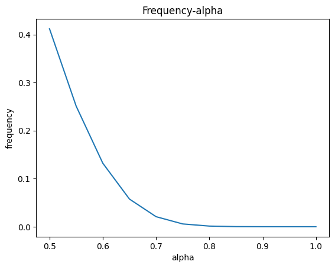
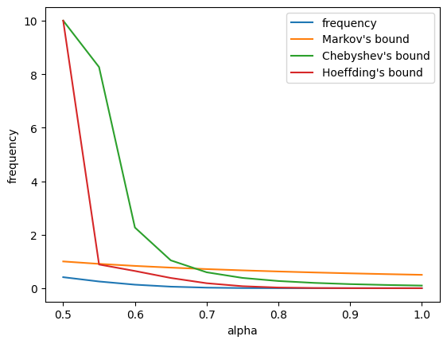
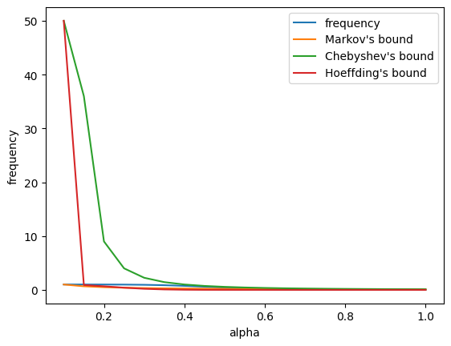
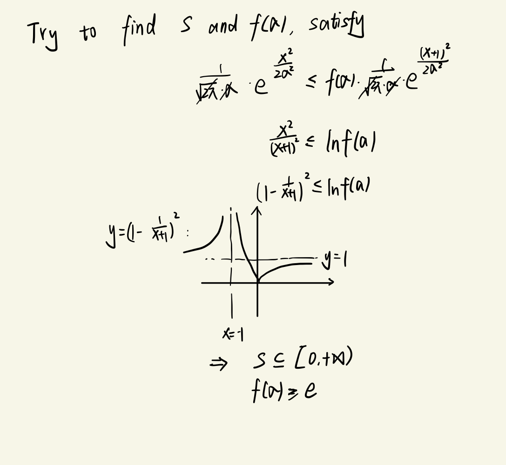

## 1.1

1.

2. The number of $X$ is only 20. As a result, the number of possible values of $\sum_i^{20} X_i$ is 21 ranging from 0 to 1 with the step 0.05. Hence $P(\frac 1 {20}\sum_i^{20}X_i \ge 0.51) \Leftrightarrow P(\frac 1 {20}\sum_i^{20}X_i \ge 0.55) $

3,4,5:

Denote $Y=\frac{1}{20}\sum_{i=0}^{20}X_i$. Given $X_i \sim (0,1)$, $EX=\frac{1}{2}$, $DX=\frac 1 4$, $EY=\frac 1 2$, $DY=\frac 1 {40}$ 

- Markov's bound: $\frac 1 {2a}$

- Chebyshev's bound: 
  $$
  \begin{aligned}
  P(|Y-EY|\ge b) &\le \frac {DX}{b^2} \\
  P(|Y-\frac 1 2 |\ge b) & \le \frac 1 {40b^2} \\
  P(Y \ge b +\frac 1 2) + P(Y \le b- \frac 1 2 ) & \le \frac 1 {40b^2}
  
  
  \end{aligned}
  $$
  Let $0.5 \le \alpha =b+\frac 1 2 \le1$, $b-\frac 1 2 \le0$, so $P(Y \le b-\frac 1 2)=0$, 
  $$
  P(Y \ge \alpha) \le \frac 1 {40(\alpha-\frac 1 2)^2}
  $$

- Hoeffding's bound:
  $$
  P(Y-EY \ge t) \le exp(-40 {t^2})
  $$
  let $\alpha = t+\frac 1 2$
  $$
  P(Y\ge \alpha) \le exp(-40(\alpha-\frac 1 2)^2)
  $$
  

When $\alpha = 0.5$, the Chebyshev's bound and Hoeffding's bound is positive infinity. I just set them as 10.

6. When $\alpha$ is close to 0.5, Markov's bound is more tight to the real frequency. When $\alpha$ gets close to 1, Chebyshev's bound and Hoeffding's bound become tighter and Hoeffding's bound is more accurate than others.
7. When $\alpha=1$, there must 20 $X_i=1$ and 0 $X_i=0$，$P(\frac 1 {20}\sum_i^{20}X_i \ge 1)=(\frac 1 2)^{20}$
   When $\alpha=0.95$, there must more than 19 $X_i=1$ $P(\frac 1 {20}\sum_i^{20}X_i \ge 1)=(\C_{20}^{19} +1) (\frac 1 2)^{20}$

For bias 0.1,

Markov's bound: $\frac 1 {10a}$

Chebyshev's bound: $\frac 9 {100(\alpha-0.1)^2}$

Hoeffding's bound: $\exp(-40(\alpha -0.1)^2)$

## 1.2

All $X_i$ are the same

$X \sim (1, 0.5)$

## 2

$$
P(\exist i:|S_i-p| \ge \epsilon) =| P(\cup^k_i|S_i-p|\ge \epsilon) \le 2\sum	_i^k \exp({2\epsilon^2n})= 2k \exp(2n\epsilon^2)
$$

## 3

1. $EL=0, DL=EL^2$
   $$
   \begin{aligned}
   \int_{-\infin}^{+\infin}x^2\cdot \frac 1 {2b} \cdot \exp(-\frac {|x|} b) dx &= 2\int_{0}^{+\infin}x^2\cdot \frac 1 {2b} \cdot \exp(-\frac {x} b) dx \\
   & = -\int_{0}^{+\infin}x^2 d(\exp(- \frac x b)) \\
   & = -\int_{0}^{+\infin} 2x\exp(-\frac x b)dx - x^2\exp(-\frac x b)|^{+\infin}_{0} \\
   & = 2b^2
   
   \end{aligned}
   $$

2. $\sigma^2=2b^2$

3. To prove,
   $$
   \exp(- \frac{|X+1|+1}{b}) \leq \exp(- \frac{|X|}{b}) \le \exp(- \frac{|X+1|-1}{b})
   $$
   $\Leftrightarrow$
   $$
   |X+1|+1 \ge |X| \ge |X+1|-1
   $$
   $X>0$
   $$
   X+2 \ge X \ge X
   $$
   $0\ge X > -1$
   $$
   X+2 \ge -X \ge X 
   $$
   $X \le -1$
   $$
   -X \ge -X \ge -X-2
   $$

4. 

   